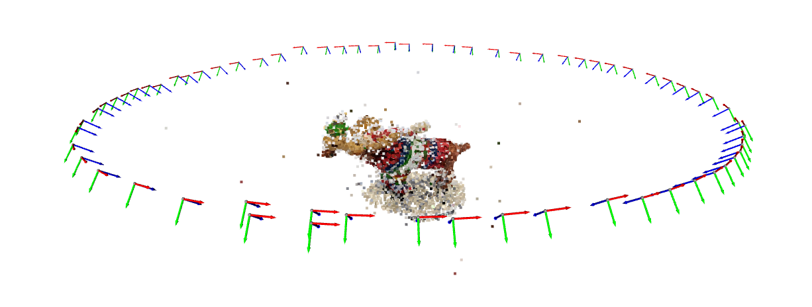

# Structure from Motion in Mojo🔥

This project was done by Taylor Pool & Easton Potokar for Geometry-Based Vision (16-822) @ CMU in Fall 2023. All the bookkeeping, initialization, and optimization (including analytical Jacobians!) were done by hand in Mojo 0.5.0. Frontend feature detection and matching is executed by `pycolmap`.

We found Mojo easy to code in, but it has some limitations and sharp edges as of right now (no dictionary/set implementation and missing a linalg library among the largest). Usage is as follows:

- `main.mojo` runs SfM. Updates are saved to an npz file every 5 iterations, and the directory is hardcoded in the `main` function (no commandline arguments yet in Mojo!).
- `plot.py` shows the resulting 3D point cloud and poses from the outputted npz file, COLMAP database, and image directory.

The library is organized in the `src` directory as follows:
- `moca` contains our linalg implementation. Most of the basic options (matrix-matrix and matrix-vector multiplication) are very well tested.
- `sfm` contains the colmap wrapper and the SfM class. This includes all incremental SfM steps from initializing poses and landmarks, bookkeeping, and optimization.
- `tests` contains about ~70 tests testing the linalg library, variables, etc.
- `variables` contains objects we optimized over. This includes trivial representations of a PinholeCamera and Landmark, and more sophisticated objects like SO3 and SE3. SO3 has a quaternion backend, with optimization performed over the Lie Algebra using the exponential map.

**More technical info can be found in the [writeup](writeup.pdf) and [slides](slides.pdf).**


## Installation

I recommend installation into a conda environment. A simple command to make and activate a new environment is
```
conda create -n sfm python=3.10
conda activate sfm
```
Then to install all required dependencies, run
```
pip install -r requirements.txt
```

## Missing Pieces
- Currently all classical computer vision estimation methods (think PnP or the 8-point algorithm) are implemented in `src/sfm/cv.mojo`, but aren't sufficiently hardened for usage in SfM.
- Despite our best efforts, we don't have a working SVD implementation in Mojo. We use numpy for this.
- Again, no working matrix equation solver (Ax = b) working either, we use scipy for this. Like we said, Mojo *needs* a linalg library!